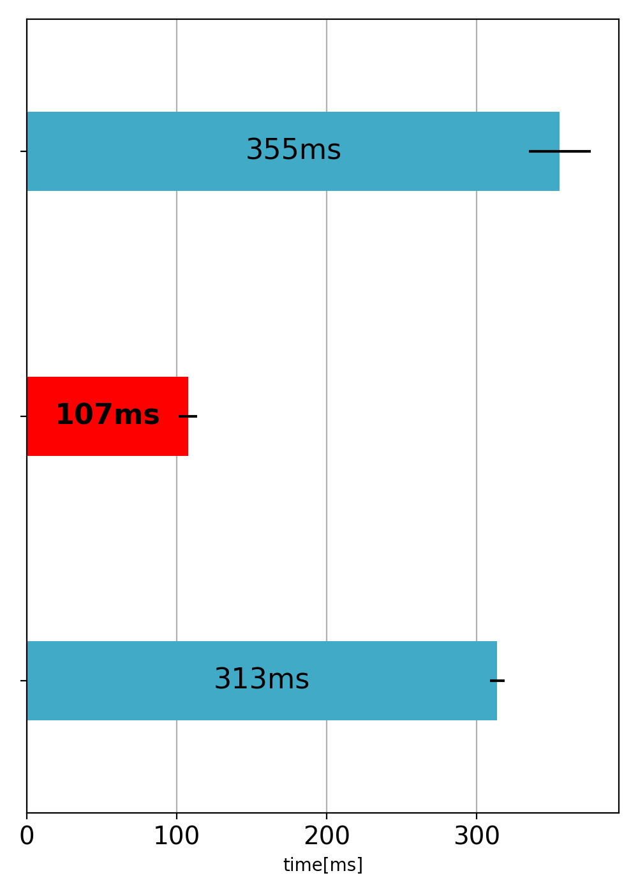
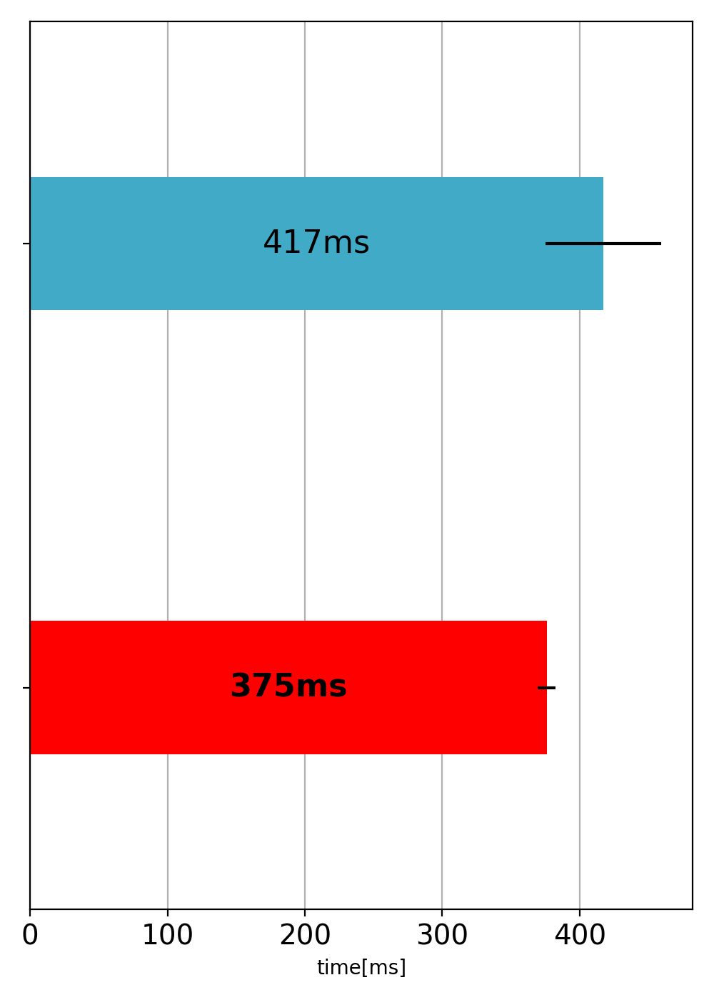

## PyCon2020

### stdin
`input()` vs `sys.stdin.readline()`


### list
```Python
def func1(n, a):
    for i in range(n):
        a[i]


def func2(n, a):
    for ai in a:
        ai


def func3(n, a):
    for i, ai in enumerate(a):
        ai
```




### sort
```Python
def func1(a):
    a.sort(key=lambda x: x[1])


def func2(a):
    from operator import itemgetter
    a.sort(key=itemgetter(1))
```




### pypy
* EDPC-B
  - [Pythonでの提出]( https://atcoder.jp/contests/dp/submissions/16017361 )
  - [PyPyでの提出]( https://atcoder.jp/contests/dp/submissions/16017364 )
